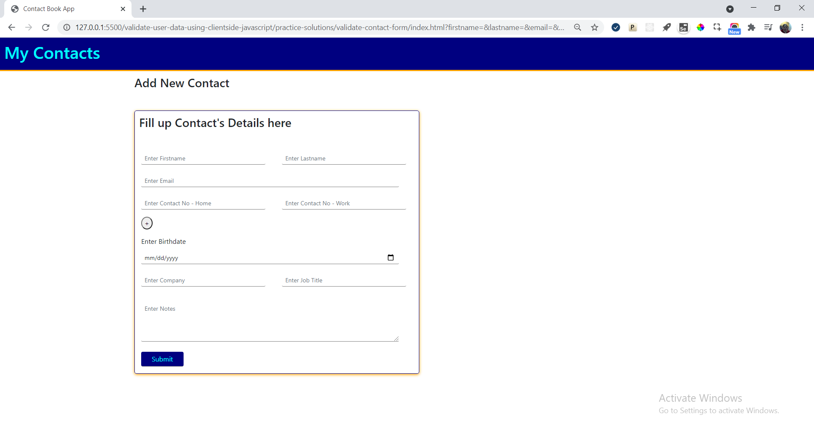

## Practice

### Implement Persistence On Contact Form Data​

#### Context

Prime Solutions is an IT solutions provider company who have earned reputation in providing IT solutions in different business domains

Recently they have received a project to develop contact book app.

Prime Solutions have approached Graffitti designers for a good UI design.

The design is ready and now it needs to be made functional.

The development will be carried out in stages.

The development is carried out in phases. The first phase is complete, whereby the inputs are captured and validated ​

In the second phase of development, you as a frontend developer have to develop solution to posted all to contacts.json file residing at the server​

##### Contact Form

Graffitti Designers have designed contact form that allows app users to provide inputs

Below is the image of UI of contact form.

#### Challenge

The inputs are captured and validated but the data is yet not persisted

The data should be persisted to `contacts.json` file served through json-server

#### Problem Statement

Persist the data to contacts.json by making HTTP calls to json-server

Ensure the response is communicated to the end-user, both for success and failures

#### Instructions

1. Download and unzip the boilerplate code.  
2. Run the command `npm install` to install the dependencies required for automated testing.  
3. Open the boilerplate code in VSCode to develop the assignment solution.
4. Provide the solution code within the file `script.js`.
5. Launch the `index.html` page on the browser to view the rendered output.
6. `contacts.json` should be created and put under a separate folder outside the application folder
7. Command to run json-server is:
`json-server -w contacts.json`
8. Test the solution locally by running the command `npm run test`.  
9. Refactor the solution to ensure all test cases are passing.  
10. DO NOT MODIFY THE PROVIDED CODE, ELSE THIS MAY IMPACT THE TEST CODE EXECUTION.

## Submitting your solution for preliminary automated review  

 1. Open https://codereview-wipro.stackroute.in/#/app and login into the platform  
 2. Under Assignment repository select `implement-persistence-on-contact-form-data`, and branch master  
 3. Under Your solution repository select your own repository and branch  
 4. Press Submit  
 5. Evaluation will take around 2 mins to complete after which you need to refresh your browser and get the updated status    
 6. Press click here for the feedback 
 7. Watch out for your total score and detailed status on each test and eslint errors in the coloured blocks on the screen  
 8. Fix failing test cases as well as eslint errors and re-submit your solution until you get 100%
